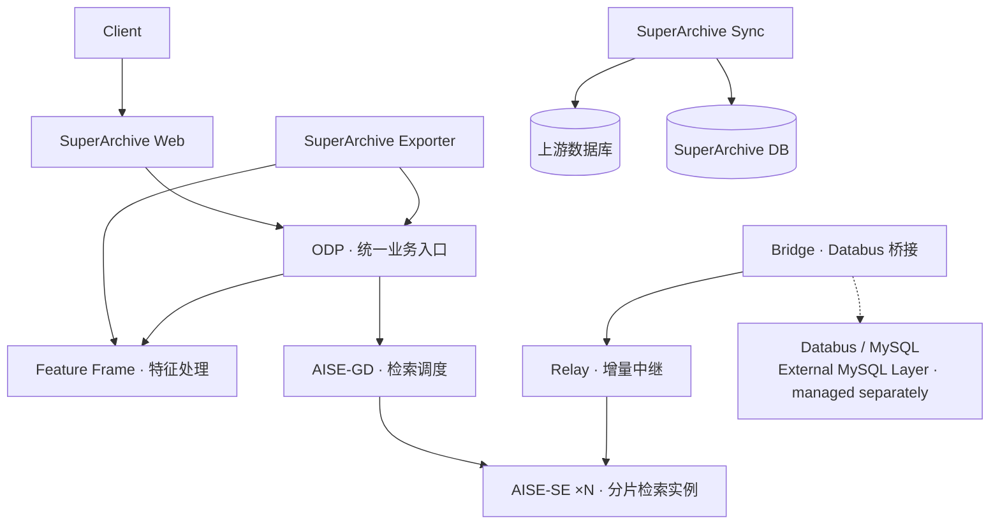
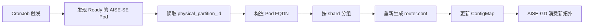

# Smart City Archive — Cloud Native Modernization

> 面向智慧城市全息档案平台的云原生改造工程：将传统多组件业务系统迁移至 Kubernetes，
> 并围绕有状态分片、动态服务拓扑、GPU 工作负载、配置外置与 Helm 交付完成云原生适配。


## 项目概览

这是一个复杂业务系统的云原生改造项目：一套由检索调度、分片检索、特征处理、数据桥接、业务入口等
多种类型组件构成的传统智慧城市档案平台，被完整迁移到 Kubernetes 之上。

重点不是重新实现人脸识别等底层算法，而是解决"系统上云"的真正难点：

- 将原有业务组件逐一容器化
- 将不同类型的组件映射为合适的 Kubernetes workload（Deployment / StatefulSet / CronJob / Job）
- 解决传统静态拓扑与 Kubernetes 动态 Pod 生命周期之间的冲突
- 对有状态分片、GPU 工作负载、配置管理和数据库初始化进行 Kubernetes 适配

## 云原生改造亮点 ✨

| 传统模式 | 云原生改造 |
| --- | --- |
| 静态进程部署 | Docker + Kubernetes 容器编排 |
| 固定 SE 后端地址 | Headless Service + Pod DNS 稳定寻址 |
| 固定分片拓扑 | CronJob 动态发现并重建 router.conf |
| 有状态分片实例 | StatefulSet + ordinal identity |
| 环境配置与程序耦合 | ConfigMap / External ConfigMap 注入 |
| 人工数据库初始化 | Kubernetes Job 自动化 bootstrap |
| GPU 应用 | `nvidia.com/gpu` resource requests/limits |
| 组件独立手工部署 | Helm Charts 标准化交付 |

## Architecture



## Kubernetes Workload Mapping

| Component | Kubernetes Model | Purpose |
| --- | --- | --- |
| odp | Deployment + Service | 统一业务入口与下游服务连接 |
| aise-gd | Deployment + CronJob | 检索调度与动态 SE topology reconciliation |
| aise-se | StatefulSet + Headless Service + PVC | 稳定分片身份与检索实例 |
| feature-frame | StatefulSet + GPU resources | 特征处理工作负载 |
| bridge | StatefulSet + PVC | Databus 增量数据桥接 |
| relay | StatefulSet + PVC + Service | 增量数据中继 |
| superarchive | Deployment / Job | 业务组件与数据库初始化 |
| databus-data-init | Job | Schema / shard table bootstrap |

## Dynamic AISE Topology 🔁

传统应用依赖静态配置的后端地址，而 Kubernetes 中 Pod IP 与实例数量都会随生命周期变化。
为此，AISE-GD 引入了 Kubernetes-aware 的拓扑适配机制：由 CronJob 周期性发现当前 Ready 的
AISE-SE Pod，读取其 `physical_partition_id`，构造 Pod FQDN 并按 shard 分组，重新生成
`router.conf` 并更新 ConfigMap，AISE-GD 随即消费新的分片拓扑。



## Stateful Sharding

AISE-SE 以 StatefulSet 部署，Pod ordinal 直接推导分片身份：

```
aise-se-0 → shard 0
aise-se-1 → shard 1
aise-se-2 → shard 2
...
```

结合 Headless Service 提供稳定的实例寻址：

```
<pod>.aise-se-service.<namespace>.svc.cluster.local
```

即使 Pod 重建、调度迁移，GD 依然能通过不变的 DNS 名字与 ordinal 身份找到对应分片。

## Data Flow

- **全量 / 查询路径**：`Client → ODP → AISE-GD → AISE-SE → Databus`
- **增量路径**：`Databus → Bridge → Relay → AISE-SE`

Databus 初始化 Job 负责创建 face schema，其中包括 `t_pic_record_0 .. t_pic_record_499`
共 500 个分片表，与 AISE-SE 的 500 shard 配置一一对应。

## GPU Workloads

仓库保留 GPU 工作负载的 Kubernetes resource configuration：

- `feature-frame` — 特征处理 GPU 工作负载
- `superarchive/web` — Web 服务 GPU 资源配置
- `aise-se` — 支持可选 GPU 配置

通过标准的 `nvidia.com/gpu` requests/limits 调度。GPU runtime 依赖环境侧的驱动与
device plugin，公开仓库不保证该部分完全可独立复现。

## Helm & Configuration ⚙️

每个主要组件均由独立的 Helm Chart 管理，统一覆盖 image、replicas、Service、ConfigMap、
resources、persistence 与 runtime endpoints。

环境相关配置通过 ConfigMap / External ConfigMap 注入，而非硬编码进镜像。例如 ODP 的
`cluster.conf` 采用 External ConfigMap 契约：Chart 在 render 阶段 fail-fast 校验
`odp.clusterConf.configMapName`，但真实的生产数据库路由拓扑不随公开仓库分发。

## Databus & MySQL Boundary 🗄️

职责边界清晰划分：

- **本仓库负责**：Databus application-side bootstrap、schema 初始化、应用侧数据库集成
- **独立 [mysql-operator](https://github.com/Rubioooooo/mysql-operator) 项目负责**：
  MySQL 集群生命周期、复制与可用性管理

两者作为独立项目协同工作，MySQL 数据层的运维能力不在本仓库范围内。

## Repository Structure 📁

```
smart-city-archive-cloud-native/
├── aise-gd/                      # 检索调度（Deployment + CronJob 拓扑协调）
├── aise-se/                      # 分片检索实例（StatefulSet + Headless Service）
├── bridge/                       # Databus 增量桥接
├── relay/                        # 增量数据中继
├── feature-frame/                # 特征处理（GPU）
├── odp/                          # 统一业务入口
├── superarchive/                 # web / sync / exporter / db-init
├── databus-data-init-job-chart/  # Databus schema 初始化 Job
└── docs/                         # 架构与 artifact 边界说明
```

每个组件目录下包含 `chart/`（Helm Chart）与 `image-build/`（容器构建定义）。

## Public Repository Boundary 🔒

**公开内容**：Helm Charts、Kubernetes manifests、Dockerfile、startup scripts、
topology automation、SQL schema/bootstrap、architecture documentation。

**不公开**：商业运行时二进制、真实业务数据、credentials、production configuration、
proprietary models/libraries。

因此，本仓库重点展示云原生改造的设计与工程实现；部分镜像需要结合环境侧的
受控 artifact 供给，不能仅凭公共仓库独立构建。详见
[docs/artifact-policy.md](docs/artifact-policy.md)。

## Project Focus 🎯

> This repository focuses on cloud-native modernization rather than reimplementing
> proprietary AI algorithms. The primary engineering focus is adapting complex legacy
> workloads to Kubernetes-native deployment, configuration, discovery, state, and
> lifecycle models.
